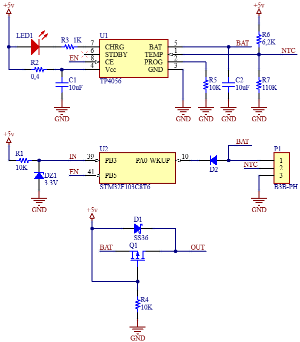

#### Контроллер Li-Ion батареи

#### Описание
Нам необходимо создать код в котором будет измеряться напряжение на  Li-Ion батарее 1S с периодичностью раз в минуту.
Если заряд батареи ниже 20%, даём команду на заряд, при превышении 80%, заряд выключаем.  

Для проекта использован драйвер TP4056:  

 

    

 

Напряжение на Li-Ion батарее будет находиться в диапазоне от 3,2 до 3,8 вольт, поэтому последовательно входу PA0-WKUP подключим диод, на котором будет падать 0,6 вольт, падение напряжения на диоде мы учтём в программе при вычислении рельного напряжения на батарее. 
___
Напряжение $V_{REFINT}$  с источника опорного напряжения заведено аппаратно на один из каналов АЦП, а именно на 17-й канал ADC1. То есть мы можем в любой момент его измерить. И по полученному значению определить, чему равно в данным момент напряжение питания. Зависимость будет выглядеть следующим образом:

$$V_{\mathit{пит}} = \frac{4095}{ADC_{\mathit{изм}}} \cdot 1,2$$  

Здесь:  
1,2 – значение в вольтах внутреннего источника опорного напряжения,  
4095 - это максимальное значение АЦП.  

И, следующим шагом, зная точное значение Vпит, рассчитаем верное значение напряжения аккумулятора:

$$V_{\mathit{акк}} = \frac{ADC_{\mathit{изм акк}}}{4095} \cdot V_{\mathit{пит}} + 0,6$$

0,6 – это падение напряжения на последовательно включенном диоде.
___
Воздействуя на вход CE драйвера TP4056, при помощи вывода EN (PB5) микроконтроллера stm32f103, мы управляем зарядом батареи. О наличии заряда сигнализирует светодиод LED1. 
Включение драйвера TP4056 производится только при наличии входного напряжения +5v. Контроль входного напряжения производим через вывод IN (PB3).  

Зарядка батареи производится минимальным током 130 mA, за это отвечает разистор R5 номиналом в 10K подкюченный к выводу PROG драйвера TP4056.  

Статус заряда батареи сохраняется в EEPROM и при каждом перезапуске микроконтроллера считывается и соответственно далается выбор включять или не включать зарядку батареи.  

Драйвер TP4056 дополнительно контролирует температуру батареи, вывод 1 (TEMP). Если напряжение на выводе TEMP ниже 45% или выше 80% напряжения питания (в данном случае +5 вольт) более 0,15 секунды это означает, что температура аккумулятора слишком высокая или слишком низкая, в этом случае зарядка приостановливается. Функцию измерения температуры можно отключить, заземлив контакт TEMP.  

___