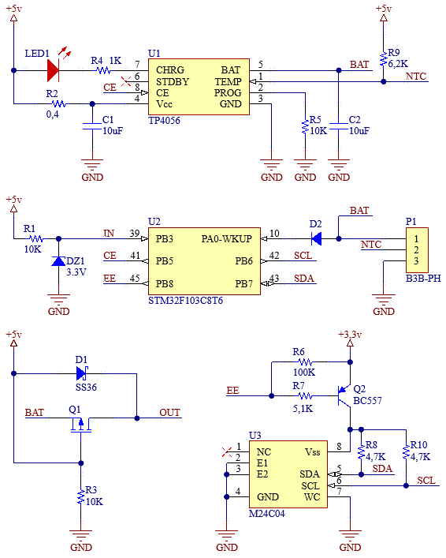

#### Контроллер Li-Ion батареи

#### Описание
Нам необходимо создать код в котором будет измеряться напряжение на  Li-Ion батарее 1S с периодичностью раз в минуту.
Если заряд батареи ниже 50%, даём команду на заряд, при превышении 80%, заряд выключаем.  

Для проекта использован драйвер TP4056:  

 

    

 

Напряжение на Li-Ion батарее будет находиться в диапазоне от 3,4 до 3,8 вольт, поэтому последовательно входу PA0-WKUP подключим диод, на котором будет падать 0,6 вольт, падение напряжения на диоде мы учтём в программе при вычислении рельного напряжения на батарее.  

Воздействуя на вход CE драйвера TP4056, при помощи вывода EN (PB5) микроконтроллера stm32f103, мы управляем зарядом батареи. О наличии заряда сигнализирует светодиод LED1. 
Включение драйвера TP4056 производится только при наличии входного напряжения +5v. Контроль входного напряжения произодим через вывод IN (PB3).  

Зарядка батареи производится минимальным током 130 mA, за это отвечает разистор R5 номиналом в 10K подкюченный к выводу PROG драйвера TP4056.  

Драйвер TP4056 дополнительно контролирует температуру батареи, вывод 1 (TEMP). Если напряжение на выводе TEMP ниже 45% или выше 80% напряжения питания (в данном случае +5 вольт) более 0,15 секунды это означает, что температура аккумулятора слишком высокая или слишком низкая, в этом случае зарядка приостановливается. Функцию измерения температуры можно отключить, заземлив контакт TEMP.  
___