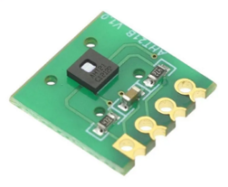
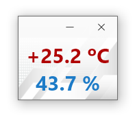

## i2c_aht21b
#### Код для получения данных с датчика AHT21b

#### Описание
Для проекта использована следующая плата с датчиком:

    

Подключение к микроконтроллеру STM32 выполняется следующим образом:

>PB7 -> SDA  
>PB6 -> SCL

Период опроса AHT21B составляет 10 секунд и настраивается в таймере TIM4.

Обработанные данные отправляем на компьютер по USB, на STM32 для этого настраиваем соответствующий раздел
Custom HID.  
VID (Vendor IDentifier) = 1155  
PID (Product IDentifier) = 22352 
___

    

Реализация визульного интерфейса для Windows находится по адресу:

https://github.com/sergeyerofeev/Application_for_UsbHID_AHT21B

Так же в папке __exe__ расположены готовые файлы для запуска приложения.

Программа каждые 10 секунд опрашивает USB на наличие подключения STM32 с датчиком AHT21B.  
При наличии соединения происходит автоматическое подключение.  

При разрыве соединения для температуры и влажности будут показаны нули, а программа перейдёт в цикл ожидания подключения.  
