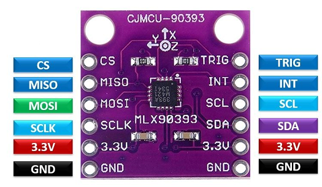
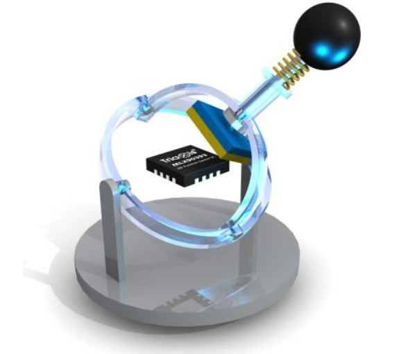

## i2c_mlx90393
#### Код для получения данных с датчика MLX90393 по трём осям XYZ

#### Описание
Для проекта использована следующая плата с датчиком:

    

Подключение к микроконтроллеру STM32 выполняется следующим образом:

>PB7 -> SDA  
>PB6 -> SCL  
>PB1 -> INT
___
Представленный код реализует манипулятор следующего исполнения:  

    

  

**Датчик необходимо размещать в центре сферы описываемой магнитом.**  

В коде производится вычисление среднего значения из восьми измерений каждой оси.

---