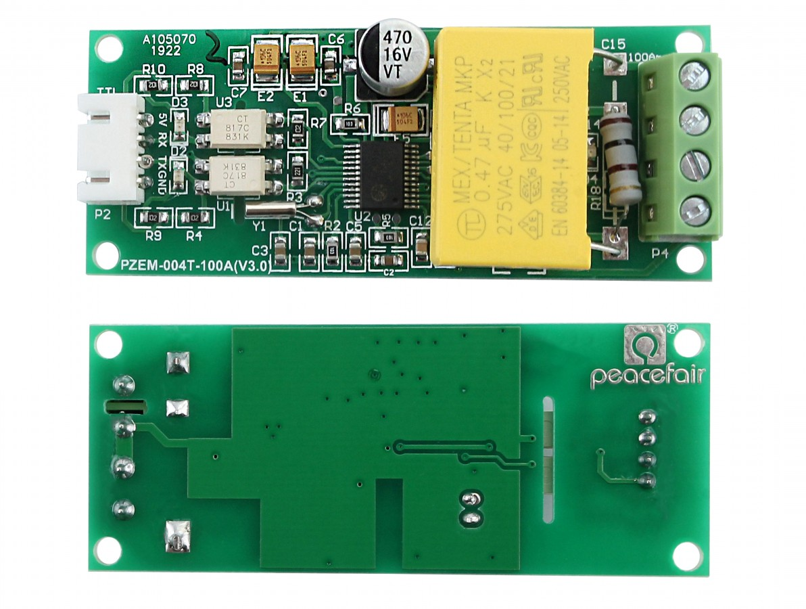
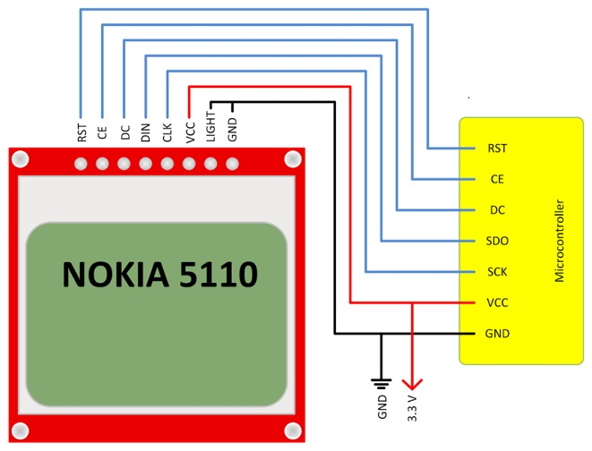
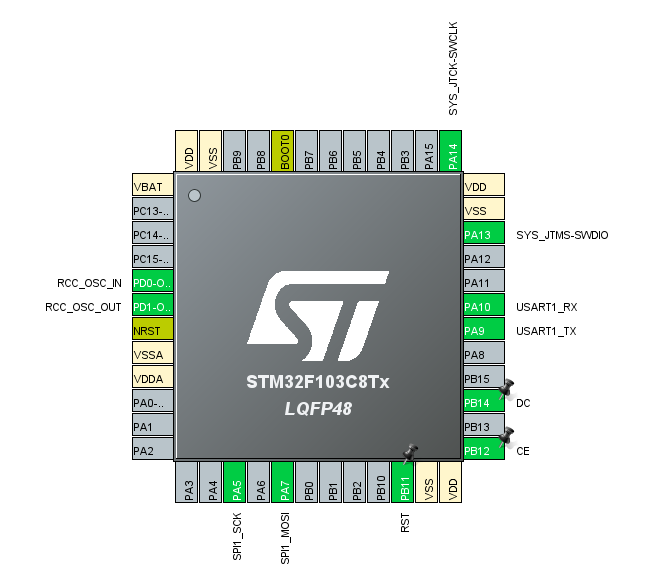

#### Код для получения данных с датчика PZEM-004T и вывода на дисплей NOKIA5110

#### Описание
Для проекта использована следующая плата с датчиком PZEM-004T-10A:

    

Подключение к микроконтроллеру STM32 выполняется к USART1 следующим образом:

>PB10 -> TX  
>PB9 -> RX  

Период опроса PZEM-004T составляет 1 секунду и настраивается в таймере TIM4.

Обработанные данные отправляем на дисплей NOKIA5110:

    

Дисплей к микроконтроллеру STM32 выполняем следующим образом:

>PB11 -> RST  
>PB12 -> CE  
>PB14 -> DC  
>PA7 -> DIN  
>PA5 -> CLK  

В результате на микроконтроллере STM32 будут задействованы следующие выводы:

    

Если данные с модуля PZEM-004T не поступают в течении 5 секунд (на датчик не подано сетевое напряжение, обрыв линии, неисправность), не дисплей выводится сообщение "WAITING FOR DATA...".

___

