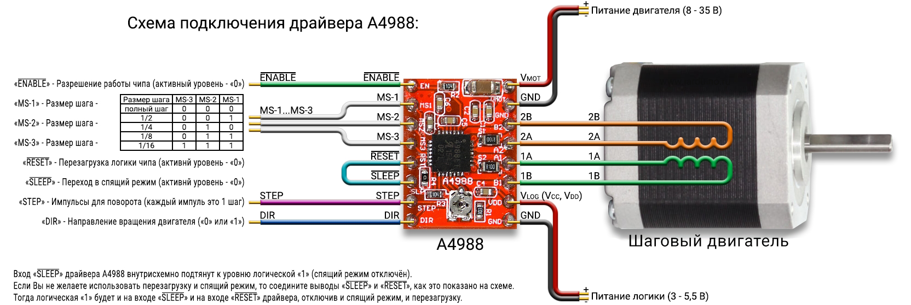

#### Код для тестирования шагового двигателя

#### Описание
Реализация визульного интерфейса для Windows находится по адресу:  
https://github.com/sergeyerofeev/Application_for_stepper_motor_test  

Связь между приложением и микроконтроллером осуществляется по USB. В приложении задаются все необходимые
параметры шагового двигателя. Подробнее на странице проекта.

Для проекта использован драйвер A4988:  
 

    

 

Подключение к микроконтроллеру STM32 выполняется следующим образом:  

>PA3 &rArr; ENABLE  
>PA4 &rArr; MS-1  
>PA5 &rArr; MS-2  
>PA6 &rArr; MS-3  
>PA0 &rArr; STEP  
>PA7 &rArr; DIR  

___

В stm32f103 нет возможности отследить обрыв соединения, при вытаскивании кабеля USB из разъёма. 
Самым простым решением будет отслеживать переход сигнала с высокого на низкий, на линии + питания USB.
В качестве входа выбираем PB4, толлерантный к 5V и имеющий отдельный обработчик внешних прерываний. 
Данный пин соединяем при помощи внешнего резистора на 20 КОм к +5V разъёма USB 
(питание от +5V USB идёт на анод диода, к нему можно подпаяться).

Пин PB4 необходимо подтянуть к земле, чтобы он не находился в неопределённом состоянии. 
Выполним при помощи внутреннего резистора, который имеет типовое сопротивление 40 КОм.
