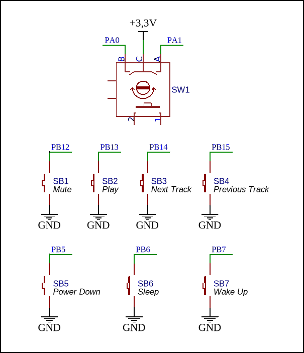

## USB регулятор громкости для ПК 

>Схема содержит следующие органы упраления:
1. Энкодер - регулировка громкости
2. Кнопка Mute - выключение звука
3. Кнопка Play
4. Кнопка Next Track
5. Кнопка Previous Track  
- Системые клавиши:
6. Кнопка Power Down
7. Кнопка Sleep
8. Кнопка Wake Up

<p align="center" >
  
</p>

>Для данного проекта ReportDescriptor имеет следующее описание:
```
char ReportDescriptor[72] = {
    0x05, 0x0c,                    // USAGE_PAGE (Consumer Devices)
    0x09, 0x01,                    // USAGE (Consumer Control)
    0xa1, 0x01,                    // COLLECTION (Application)
    0x85, 0x01,                    //   REPORT_ID (1)
    0x05, 0x0c,                    //   USAGE_PAGE (Consumer Devices)
    0x09, 0xe2,                    //   USAGE (Mute)                    0000 0001 (0x01)
    0x09, 0xe9,                    //   USAGE (Volume Up)
    0x09, 0xea,                    //   USAGE (Volume Down)
    0x09, 0xb0,                    //   USAGE (Play)                    0000 1000 (0x08)
    0x09, 0xb5,                    //   USAGE (Scan Next Track)         0001 0000 (0x10)
    0x09, 0xb6,                    //   USAGE (Scan Previous Track)     0010 0000 (0x20)
    0x15, 0x00,                    //   LOGICAL_MINIMUM (0)
    0x25, 0x01,                    //   LOGICAL_MAXIMUM (1)
    0x75, 0x01,                    //   REPORT_SIZE (1)
    0x95, 0x06,                    //   REPORT_COUNT (6)
    0x81, 0x02,                    //   INPUT (Data,Var,Abs)
    0x75, 0x01,                    //   REPORT_SIZE (1)
    0x95, 0x02,                    //   REPORT_COUNT (2)
    0x81, 0x03,                    //   INPUT (Cnst,Var,Abs)
    0xc0,                          // END_COLLECTION
    0x05, 0x01,                    // USAGE_PAGE (Generic Desktop)
    0x09, 0x80,                    // USAGE (System Control)
    0xa1, 0x01,                    // COLLECTION (Application)
    0x85, 0x02,                    //   REPORT_ID (2)
    0x05, 0x01,                    //   USAGE_PAGE (Generic Desktop)
    0x09, 0x81,                    //   USAGE (System Power Down)       0000 0001 (0x01)
    0x09, 0x82,                    //   USAGE (System Sleep)            0000 0010 (0x02)
    0x09, 0x83,                    //   USAGE (System Wake Up)          0000 0100 (0x04)
    0x15, 0x00,                    //   LOGICAL_MINIMUM (0)
    0x25, 0x01,                    //   LOGICAL_MAXIMUM (1)
    0x75, 0x01,                    //   REPORT_SIZE (1)
    0x95, 0x03,                    //   REPORT_COUNT (3)
    0x81, 0x02,                    //   INPUT (Data,Var,Abs)
    0x75, 0x01,                    //   REPORT_SIZE (1)
    0x95, 0x05,                    //   REPORT_COUNT (5)
    0x81, 0x03,                    //   INPUT (Cnst,Var,Abs)
    0xc0                           // END_COLLECTION
};
```
